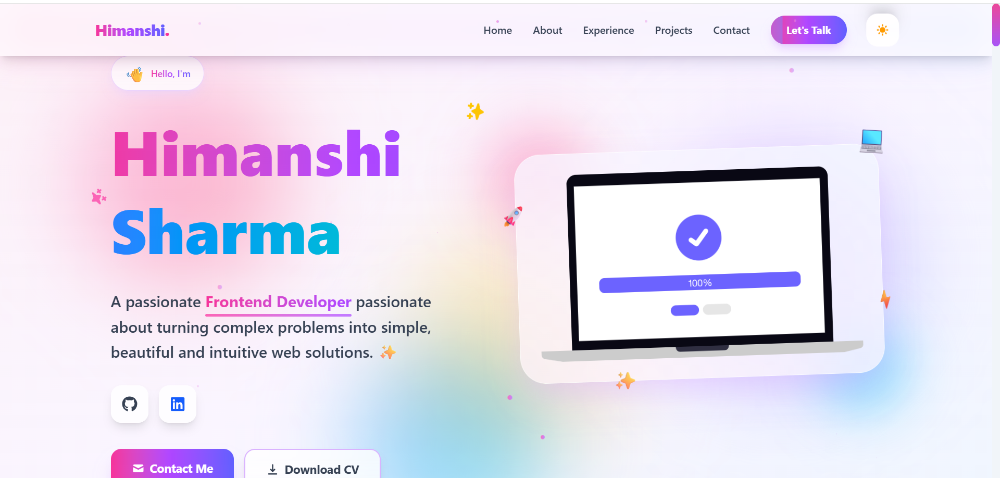

# 🌟 Himanshi Sharma – Developer Portfolio


A modern, responsive, and animated personal portfolio built using **React, TypeScript, Vite, Tailwind CSS, and Framer Motion** to showcase my projects, skills, and experience.

🔗 **Live Portfolio:**  
https://himanshi-portfolio-two.vercel.app/

---

## ✨ Features

- 🎨 Modern UI with glassmorphism design  
- 📱 Fully Responsive (Mobile + Tablet + Desktop)  
- ⚡ Fast performance using Vite  
- 🎬 Smooth animations using Framer Motion  
- 🌙 Dark / Light mode support  
- 💼 Projects showcase with live demo links  
- 📧 Contact section  

---

## 🛠️ Tech Stack

- React  
- TypeScript  
- Vite  
- Tailwind CSS  
- Framer Motion  
- React Icons 
 

---

## 📂 Sections Included

- Hero Section  
- About Me  
- Skills  
- Featured Projects  
- Experience  
- Education  
- Contact  

---

## 🚀 Run Locally

```bash
git clone https://github.com/Himanshi8790-Sharma/your-repo-name.git
cd your-repo-name
npm install
npm run dev


🌐 Deployment

This portfolio is deployed on Vercel.

🔗 Live Link:
https://himanshi-portfolio-two.vercel.app/


👩‍💻 Author

Himanshi Sharma

🌐 Portfolio: https://himanshi-portfolio-two.vercel.app/

💻 GitHub: https://github.com/Himanshi8790-Sharma/Himanshi-Portfolio